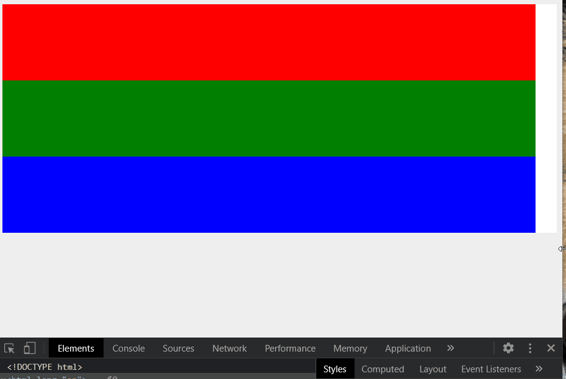
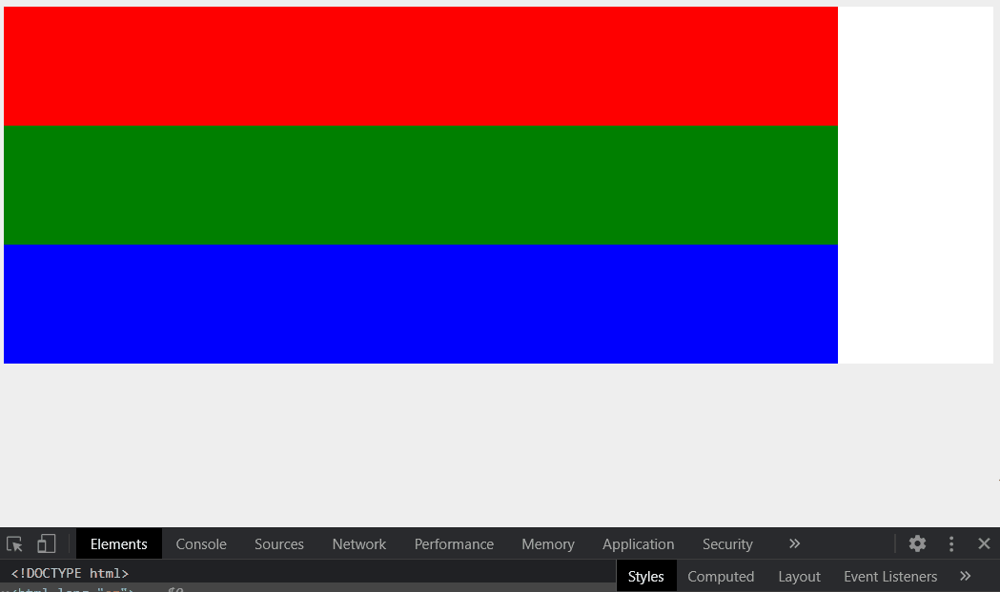

# CSS Flexbox Tutorial - NINJA

[CSS Flexbox Tutorial](https://www.youtube.com/playlist?list=PL4cUxeGkcC9i3FXJSUfmsNOx8E7u6UuhG)

# Index

- [Flex Container]()
- [Flex Grow]()
- [Flex Shrink]()
- [Flex Wrap]()
- [Flex Basis]()
- [Flex one line syntax]()
- [Flex Menu (nav)]()
- [Navbar Entire Code]()
- Flex Order

# Flex Container

consider the html is: 

```html
<body>
  <div class="wrapper" >
    <div class="flex-container">
      <div class="**box** one"></div>
      <div class="**box** two"></div>
      <div class="**box** three"></div>
    </div>
  </div>
</body>
```

In this case `.box` class do not have any content and by default will has width of 0, so we has to give it a `min-width` and `min-hight` to make it appears in the page 

```css
.flex-container {
  display: flex;
  background-color: #fff;
  justify-content: flex-end; // make elements float from right
}
.box {
  **height: 100px;
  min-width: 100px;**
}
.one {
  background-color: red;
  flex-grow: 1;
}
.two {
  background-color: green;
  flex-grow: 2;
}
.three {
  background-color: blue;
  flex-grow: 3;
}
```

# Flex Grow

We use it to allow elements to grow according to the available space. To specify how an element will grow according to its **siblings** we use `flex-grow: <number>` property and the bigger is the this number the more element grows:

```css
.one {
  background-color: red;
  **flex-grow: 1;**
}
.two {
  background-color: green;
  **flex-grow: 2;**
}
.three {
  background-color: blue;
  **flex-grow: 3;**
}
```

The output HTML


# Flex Shrink

It's the opposite of ***flex grow***, instead of determining the rate at which they grow we are gonna determine the rate at which they shrink **as the browser gets smaller**.

We can apply this using `flex-shrink: <number>` and the bigger is the shrink number is the the more the element shrinks(become smaller):

```css
.one {
  background-color: red;
  **flex-shrink: 0;**
}
.two {
  background-color: green;
  **flex-shrink: 2;**
}
.three {
  background-color: blue;
  **flex-shrink: 3;**
}
```

The output HTML


# Flex Wrap

When reach to the specified minimum width the element wrap to the next line, and take all the available space down there instead.

We specify that in  the container of the flex elements, `.flex-container` 

So if the the flex element exceeded its minimum width will wrap to the next line:

```css
**.flex-container** {
  display: flex;
  background-color: #fff;
  **flex-wrap: wrap;**
}

.box {
  height: 100px;
  **min-width: 200px;**
  flex-grow: 1;
}
```

The output HTML


> If we remove the attribute `flex-grow` from `.box` class then the wrapped element (the blue div) will not extends to take all available space it just take its minimum width `200px` , look at the next image...

```css
.box {
  height: 100px;
  **min-width: 200px;**
  **/* flex-grow: 1; */**
}
```


# Flex Basis

Flex basis is pretty similar to minimum width that it defines a starting width of each element so instead of minimum width we can write `flex-basis: <number>`

The main difference between `min-width` and `flex-basis` is that:

In case of the `min-width`,  if the browser width is less than the minimum width then the the elements will never shrink and will stick to its width and we can scroll to reach the rest of the element width.

```css
.wrapper {
  width: 100%;
  **max-width: 960px;**
  margin: 0 auto;
}
.flex-container {
  display: flex;
  background-color: #fff;
  **flex-wrap: wrap;**
  /* flex-wrap: wrap-reverse; */
}
.box {
  height: 100px;
  **min-width: 700px;**
  /* flex-grow: 1; */
}
```



But in the second case `flxe-basis`, if the browser width is less than the `flex-basis` width then the elements will shrink and follow up the browser window

```css
.wrapper {
  width: 100%;
  **max-width: 960px;**
  margin: 0 auto;
}
.flex-container {
  display: flex;
  background-color: #fff;
  **flex-wrap: wrap;**
  /* flex-wrap: wrap-reverse; */
}
.box {
  height: 100px;
  **flex-basis: 700px;**
  /* flex-grow: 1; */
}
```

The same browser width as the previous case but the elements shrink to follow up this width, so there is no scroll 



# Flex one line Syntax

```css
/* flex: <flex-grow> <flex-shrink> <flex-basis> */
flex: 0 0 100px;
```

# Flex Menu (nav)

When use `ul` to list the elements we must set `margin
: 0;` to that `ul` as it automatically takes margin that make the nav looks like that:


HTML code 

```html
<nav>
    <ul>
      <li><a href="github.come/rayyanx95">Home</a></li>
      <li><a href="github.come/rayyanx95">lorem</a></li>
      <li><a href="github.come/rayyanx95">Store</a></li>
      <li><a href="github.come/rayyanx95">Contact</a></li>
    </ul>
  </nav>
```

CSS Code 

```css
nav {
  background: #333;
  box-sizing: border-box;
}
nav **ul** {
  list-style-type: none;
  **margin: 0;**
}
```

# Navbar Entire Code

The HTML and CSS code for the entire navbar

```html
<div class="wrapper">
  <nav>
    <ul>
      <li><a href="github.come/rayyanx95">Home</a></li>
      <li><a href="github.come/rayyanx95">lorem</a></li>
      <li><a href="github.come/rayyanx95">Store</a></li>
      <li><a href="github.come/rayyanx95">Contact</a></li>
    </ul>

    **<ul class="social">
      <li><a href="" class="fb">Facebook</a></li>
      <li><a href="" class="tw">Twitter</a></li>
    </ul>**
  </nav>
</div>>
```

```css
.wrapper {
  width: 100%;
  margin: 0 auto;
}
nav {
  background: #333;
  box-sizing: border-box;
}
nav ul {
  list-style-type: none;
  margin: 0;
  padding: 0;
}
nav a {
  text-decoration: none;
  color: #fff;
  display: block;
  padding: 10px;
  text-align: center;
}
nav a:hover {
  background: #555;
}
/* Social menu styles */
**a.fb {
  background: center no-repeat
    url('https://www.flaticon.com/svg/vstatic/svg/1312/1312139.svg?token=exp=1619278982~hmac=7393d6726dcdae9133edf7fe1c30963d');
  background-size: 90%;
}
a.tw {
  background: center no-repeat
    url('https://www.flaticon.com/svg/vstatic/svg/145/145812.svg?token=exp=1619278941~hmac=564b62e3b4940e6bec0555d9fb2e25f9');
  background-size: 90%;
}
.social a {
  text-indent: -9999px;
}
.social {
  max-width: 60px;
  margin: 0 auto;
}**
/*  flex styles */
**.social {
  flex: 1 1 0;
  display: flex;
}
.social li {
  flex: 1 1 0;
}**
@media screen and (min-width: 768px) {
  nav ul {
    display: flex;
    justify-content: space-between;
  }
  nav li {
    flex-grow: 1;
    flex-shrink: 1;
    flex-wrap: 0;
  }
  nav {
    display: flex;
    justify-content: space-between;
  }
  **.social {
    margin: 0;
  }**
}
```

# Flow and Axis

We use `flex-flow` property to change the flow direction from row (default behavior) to column and vice-versa.

In case of `flex-flow: column` the `flow-basis` no longer controls the elements width, it now controls the elements height

```css
.flex-container {
  ... ;
  **flex-flow: column;**
}
.box {
  height: 100px;
  /* flex: <flex-grow> <flex-shrink> <flex-basis> */
  **flex: 0 0 150px; // .box elemet will have height of 150px not 100px**
}
```

### Main and Cross Axis


There are properties that applied to main axis and there are others applied only to cross axis.

***Applied to main axis***

- `justify-content`

***Applies to cross axis***

- `align-items`

# Flex order

We can use flex to change the order of the flex elements. We apply this using `order: <number>` property where lower the number goes at first and the higher goes last.

```html
<div class="wrapper">
    <section id="blocks" >
      **<div class="one">1</div>
      <div class="two">2</div>
      <div class="three">3</div>
      <div class="four">4</div>**
    </section>
  </div>
```

CSS code

```css
.wrapper {
  width: 100%;
  max-width: 960px;
  margin: 0 auto;
}
#blocks {
  display: flex;
  margin: 10px;
  justify-content: space-between;
}
#blocks div {
  flex: 0 0 100px;
  padding: 40px 0;
  text-align: center;
  background: #ccc;
}
**.one {order: 9;}
.two {order: 2;}
.three {order: 7;}
.four {order: 5;}**
```

The output UI

